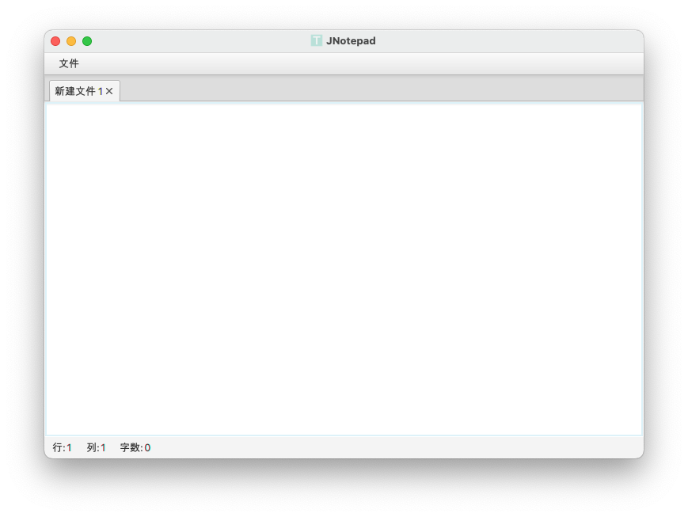

  
<h1 align="center" style="margin: 30px 0 30px; font-weight: bold;">JNotepad</h1>
<h4 align="center" style="margin: 30px 0 30px; font-weight: bold;">JavaFx开发，插件驱动，创造无限可</h4>

    
    

    
    

    
    
    

    

[jnotepad-official-plugins]:https://gitee.com/jcnc-org/jnotepad-official-plugins
[jcnc-docs]:https://gitee.com/jcnc-org/docs

| 序号  | 相关仓库          |  链接地址                              |
|:---: | :---------------: |  :-----------------------------------:|
|1     | JNotepad插件仓库   | [点击访问][jnotepad-official-plugins]  |
|2     | JCNC文档仓库       | [点击访问][jcnc-docs]                  |

JNotepad(Java Notepad)
是一款简约而强大的跨平台文本编辑器，旨在提供用户友好的界面和丰富的功能以及插件化使用。无论你是在Linux、Windows还是macOS系统上使用，JNotepad都能满足你对文本编辑和查看的需求。
JNotepad使用Java语言编写，并基于JavaFX框架开发，具有良好的可扩展性和稳定性。

## 功能介绍

- 文本编辑和查看：JNotepad提供了完善的文本编辑和查看功能，使你能够轻松创建、编辑和浏览各种类型的文本文件。

- 跨平台支持：不论你使用哪种操作系统，JNotepad都能够无缝地适应，并提供一致的用户体验。

- 轻量级设计：JNotepad采用简约而现代的设计风格，界面清晰简洁，使得使用起来非常直观和便捷。

- 基于Java：JNotepad使用Java语言编写，并基于JavaFX框架开发，具有良好的可扩展性和稳定性。

## 安装教程

1. Windows 平台，可以直接使用编译的可执行程序或自己编译

[gitee-download]: https://gitee.com/jcnc-org/JNotepad/releases

[java-download]: https://www.oracle.com/cn/java/technologies/downloads/

[qq-url]: http://qm.qq.com/cgi-bin/qm/qr?_wv=1027&k=zOfwWb1lcle68cbEdJCjSIp3Itx0nEC0&authKey=bOsZFT9OVYZpZQbS6IYO4onBQoeBorF5nanMEi1G%2FgPbzmUkOweXBo9qB0G34R5K&noverify=0&group_code=386279455

[docs-url]: https://gitee.com/jcnc-org/docs

- [下载][gitee-download]

2. Linux/MacOS 平台，查看入门指南

## 入门指南

要使用 JNotepad，请按照以下步骤进行:

1. 下载并安装 Java（如果尚未安装）。

- [下载][gitee-download]

2. 克隆或下载 JNotepad 项目。

<pre><code>git clone https://gitee.com/jcnc-org/JNotepad.git</code></pre>

3. 在您偏好的 Java IDE 中打开项目。

## 使用方法

1. 运行 `JNotepad` 类以启动应用程序。
2. 主窗口将显示菜单栏、标签区域和状态栏等。
3. 使用菜单栏执行各种操作：

- `文件 > 新建`：创建一个带有空白文本区域的新标签。
- `文件 > 打开`：打开现有文本文件进行编辑。
- `文件 > 保存`：将当前活动标签的内容保存到关联文件中。
- `文件 > 另存为`：将当前活动标签的内容保存为新文件。
- `文件 > 重命名`：将当前活动标签的内容重命名。

- `设置 > 自动换行`：打开当前文本自动换行。
- `设置 > 打开配置文件`：打开JNotepad的配置文件实现配置快捷键和其他功能。
- `设置 > 窗口置顶`：将程序主仓库置顶。
- `设置 > 语言`：切换语言。

- `插件 > 增加插件`：(管理插件系统,待完善)。

## 依赖项

POM文件中的全部依赖项：

| 组ID                        | 工件ID                   | 版本     | 功能描述                                       |
|--------------------------------|------------------------------|--------|------------------------------------------------|
| org.kordamp.ikonli             | ikonli-javafx                | 12.3.1 | 提供JavaFX应用程序中的图标集成。              |
| org.kordamp.ikonli             | ikonli-antdesignicons-pack   | 12.3.1 | 包含Ant Design图标集的Ikonli图标包。          |
| io.github.mkpaz               | atlantafx-base               | 2.0.1  | 提供Atlantafx库的基本功能。                   |
| org.openjfx                    | javafx-fxml                  | 20.0.2 | JavaFX的FXML模块，用于构建用户界面。         |
| org.junit.jupiter             | junit-jupiter-api            | 5.9.2  | 用于JUnit 5测试框架的API。                    |
| com.fasterxml.jackson.core     | jackson-databind             | 2.15.2 | 用于JSON数据的序列化和反序列化。              |
| org.slf4j                      | slf4j-api                    | 2.0.7  | 简单日志门面，用于处理日志记录。              |
| ch.qos.logback                 | logback-core                 | 1.4.11 | Logback的核心组件，用于日志记录。            |
| ch.qos.logback                 | logback-classic              | 1.4.11 | Logback的经典模块，提供日志记录功能。        |
| com.ibm.icu                    | icu4j                        | 73.2   | ICU（International Components for Unicode）库，用于处理Unicode字符和文本。|

## 软件运行截图

- Windows 平台
  
- MacOS 平台   
  

### 参与贡献

1. 加入JCNC社区
1. [阅读JCNC开发者文档][docs-url]
1. [加入QQ群:386279455][qq-url]
1. 联系微信:xuxiaolankaka 加入群聊