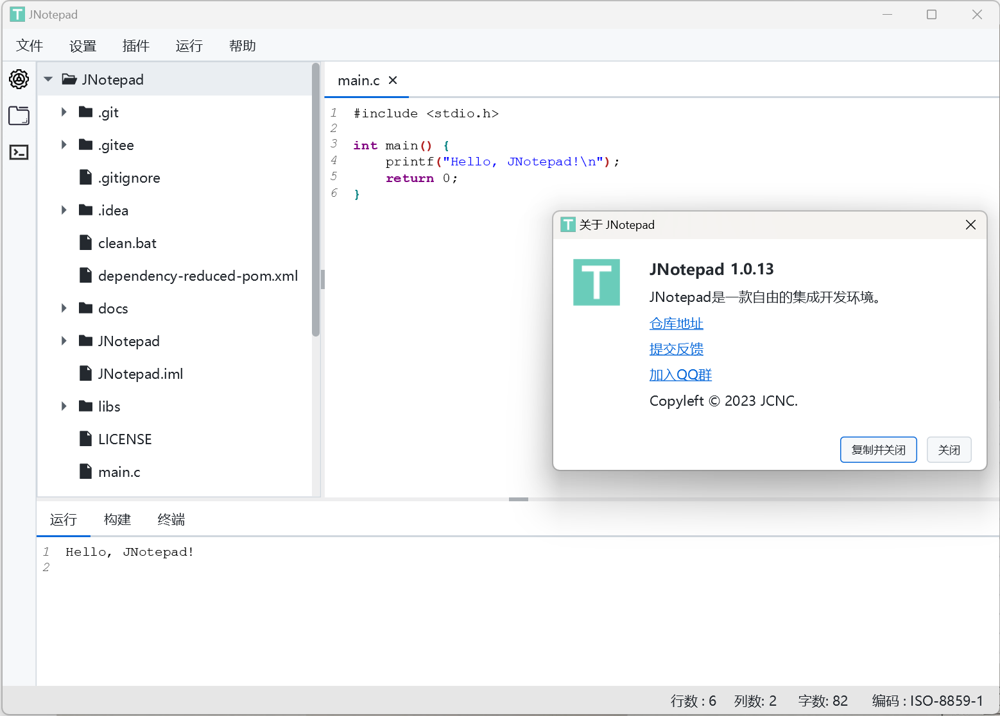

# Jnotepad

qq群：386279455

#### 软件运行截图
- Windows 平台
  

#### 安装教程

1.  Windows 平台，可以直接使用我编译好的可执行程序或自己编译

[gitee-download]: https://gitee.com/jcnc-PC/jnotepad/releases
- [下载][gitee-download]

2. Linux/MacOS 平台，克隆后自行编译

<pre><code>clone https://gitee.com/jcnc-PC/jnotepad.git</code></pre>

#### 参与贡献

1. Fork 本仓库
2. 加入JCNC社区
3. 新建分支
4. 提交代码
5. 新建 Pull Request
