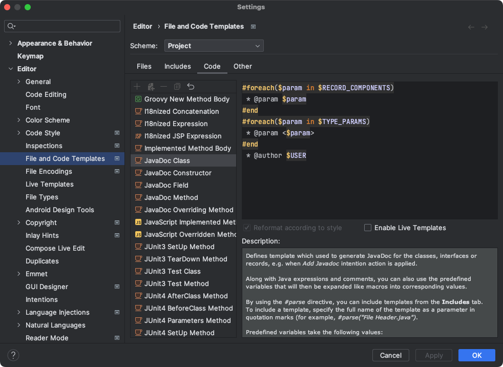

# 代码规范

## 1. 排版规则

### 1.1 编码

**规 则：IDE的text file encoding设置为UTF-8。**  
**规 则：IDE中文件的换行符使用Unix格式，不要使用windows格式。**

**补 充：**
本项目中`.idea/encodings.xml`已定义src、resource目录为UTF-8编码，禁止修改。

### 1.2 页宽

**规 则：编辑器列宽应设置为120**  
**说 明：**
当一行代码的长度过长时，为了阅读方便，应该换行展示。但因为每个人的字体设置，屏幕大小有所不同，因此需要统一列宽为120。  
**补 充：**  
IDEA默认列宽为120。本项目的.idea/codeStyles目录中应用的即为IDEA默认配置。

### 1.3 换行

**规 则：第二行相对第一行缩进4个空格，从第三行开始，不再缩进，而是与第二行保持同级。**  
**规 则：运算符、方法调用的点符号与下文一起换行。**  
**规 则：在多个参数超长时，逗号后换行。**  
**示 例：**

```java
//符合规范
StringBuffer sb=new StringBuffer();
//超过100个字符的时候，换行缩进4个空格，并且方法钱的点符号一起换行
        sb.append("wan").append("fang")...
        .append("shu")...
        .append("ju")...
        .append("gu");
//在逗号后换行
        method(arg1,arg2,arg3,...argx,
        argx1)
```

### 1.4 缩进

**规 则：程序块需要采用缩进风格编写，缩进为4个空格。**  
**说 明：** 不同的编辑工具会导致Tab字符的宽度不统一，在编码时应注意其可能造成的问题。  
**补 充：**  
本项目的.idea/codeStyles目录中应用的即为IDEA默认配置。

### 1.5 空行

**规则：独立的程序块与变量声明之间加空行分割**
**示 例：**

```java
//不符合规范
if(log.getLevel()<LogConfig.getRecordLevel()){
        return;
        }
        LogWriter writer;
        int index;
```

```java
//符合规范
if(log.getLevel()<LogConfig.getRecordLevel()){
        return;
        }

        LogWriter writer;
        int index; 
```  

### 1.6 大括号

**规 则：使用大括号（即使是可选的）**  
**说 明：** 大括号与if, else, for, do, while即使只有一条语句或是空，也应该把大括号写上。  
**示 例：**

```java
//不符合规范的
if(writeToFile)
        writeFileThread.interrupt();
```

```java
//符合规范的
if(writeToFile){
        writeFileThread.interrupt();
        }
```  

**规 则：对于非空块和块状结构，大括号遵循Kernighan和Ritchie风格（紧凑风格）。**  
**说 明：**

* 左大括号前不换行
* 左大括号后换行
* 右大括号前换行
* 如果右大括号是一个语句、函数体或类的终止，则右大括号后换行; 否则不换行。例如，如果右大括号后面是else或逗号，则不换行

**示 例：**

```java
//不符合规范
if(isOk)
        {
        someThing();
        }
        else
        {
        otherThing();
        }
```

```java
//符合规范
if(isOk){
        someThing();
        }else{
        otherThing();
        }
```  

**补 充：**  
Kernighan和Ritchie风格指的是，Kernighan和Ritchie的《C Programming
Language》一书中约定的“大括号放在同一行”规则。这种编码风格比较紧凑，也是Java官方和Google等诸多主流公司遵循的编码风格。

**建 议：空块可以简洁的写成{}，除非它是多块语句的一部分。**  
**说 明：** 一个空的块状结构里什么也不包含，大括号可以简洁地写成{}，不需要换行。例外：如果它是一个多块语句的一部分(if/else 或
try/catch/finally) ，即使大括号内没内容，右大括号也要换行。  
**示 例：**

```java
void doNothing(){}
``` 

### 1.7 小括号

**规 则：用小括号来限定计算优先级**  
**说 明：** 没有理由假设代码的阅读者能够清晰的记住整个Java运算符优先级表。
###2.8 空格
**规 则：函数参数在“，”后需要加空格。**  
**规 则：各种双目操作符，比如“=”，“<”等，前后都要加空格。**  
**规 则：if, while等关键字后面需要有空格。**  
**补 充：** 基本上Eclipse的自动格式化功能，就能保证这些空格的正确使用。

### 1.8 TODO

**规 则：TODO用于任务标记，要避免出现无用的TODO标记**  
**说 明：** 自动生成代码中如果有TODO标记，请根据需要编写注释或删除TODO标记，避免产生无用的TODO，影响他人跟踪任务。

### 1.9 import

**规 则：import不要使用通配符**  
**说 明：** 不要出现类似这样的import语句：import java.util.*。使用通配符会造成歧义，及不可预期的冲突或bug。程序应保持清晰、易懂、无歧义。

**规 则：import不要引用不需要的包**

### 1.10 变量

**规 则：每次只声明一个变量**  
**说 明：** 不要使用组合声明（int a,b;），减少歧义性，增强可读性

**规 则：需要时才声明，并尽快进行初始化**

**规 则：使用非C风格的数组声明**    
**说 明：** 使用String[] args，而非String args[]

**建 议：谨慎的使用公共变量**  
**说 明：** 公共变量是增大模块间耦合的原因之一，应减少没必要的公共变量以降低模块间的耦合度。

## 2 命名规范

**规 则：命名应尽可能做到见名知意，力求语义表达清晰完整。**  
**规 则：代码中的命名均不能以下划线或美元符号开始，也不能以下划线或美元符号结束。**  
**规 则：代码中的命名严禁使用拼音与英文混合的方式，更不允许直接使用中文的方式。**

### 2.1 package

**规 则：包名均采用小写**  
**建 议：包名一般为一个单词**

**规 则：内部包名规则一般为com.部门名称/站点域名.产品名/项目名.模块名，通用包放在com.wanfangdata下**  
**说 明：** 由于历史遗留原因，部分内部包名格式为：部门名称.产品名/项目名.模块名。原则上，新建的包不要用此命名规则，但暂时也不修改此规则的包名

### 2.2 Class

**规 则：类的命名应该都是名词**  
**规 则：类名第一个字母要为大写，其他每个单词的第一个字母为大写（UpperCamelCase）**  
**规 则：类名要用完整的单词，除非是被公认的单词缩写**  
**规 则：抽象类命名应以Abstract为开头**  
**规 则：异常类命名使用Exception结尾**
**规 则：测试类命名以它要测试的类名称开始，以Test结尾**

**建 议：如果使用了设计模式，建议在类(接口)命名中体现出具体的设计模式**
**建 议：枚举类名以Enum后缀结束，美剧成员名称需要全部大写，单词间用下划线分隔。**  
**示 例：**

```java
public class BalanceLimitAccountHandler;

public interface SqlSessionFactory;

public class LoginProxy;
```

### 2.3 Interface

**规 则：接口名的命名应该是名词或形容词**  
**规 则：接口名应以大写的I开头，其他单词第一个字母都要大写（UpperCamelCase）**  
**规 则：接口名要用完整的单词，除非是被公认的单词缩写**  
**建 议：接口类中的方法和属性不要加任何修饰符好（public也不要加）。**

### 2.4 方法命名

**规 则：方法名应以动词或惯用短语描述**  
**规 则：方法名第一个字母都要小写，其他每个单词第一个字母都要大写（lowerCamelCase）**

**建 议：方法名中不要加入对象名字，可能会带来误解。**  
**说 明：** 因为对象本身已经包含在调用语句中了

### 2.5 变量

**规 则：应避免用单个字符命名变量**  
**规 则：代码中严禁使用拼音与英文混合的方式，优先使用英文而非拼音**

**规 则：参数名第一个字母使用小写，其他每个单词第一个字母大写（lowerCamelCase）**

**规 则：常量名应该为名词或名词短语**  
**规 则：常量名每一个字母都应为大写，单词之间用“_”分开。**  
**规 则：不允许出现任何魔法值（未经定义的常量）直接出现在代码中。**  
**建 议：不要使用一个常量类维护所有常量，应该按常量功能进行归类，分开维护。**

**规 则：long或者Long初始赋值时，必须使用大写的L，不能是小写的l，小写容易跟数字1混淆，造成误解。**

**规 则：局部变量名第一个字母使用小写，其他每个单词第一个字母大写（lowerCamelCase）。**  
**规 则：局部变量名可以更宽松的使用缩写，但除了临时变量和循环变量应避免单字符命名。**

**规 则：POJO类中布尔类型的变量，都不要加is，否则部分框架解析会引起序列化错误。（参考阿里java规范）**  
**说 明：**  
定义为基本数据类型Boolean isSuccess；的属性，它的方法也是isSuccess()，RPC框架在反向解析的时候，“以为”对应的属性名称是success，导致属性获取不到，进而抛出异常。

## 注释规范

见目录: .idea/fileTemplates/code

如需增加新的注释模板，进入IDEA设置->Editor->File and Code Templates，可进行修改。    
⚠️注意：确保schema选择的是project。
